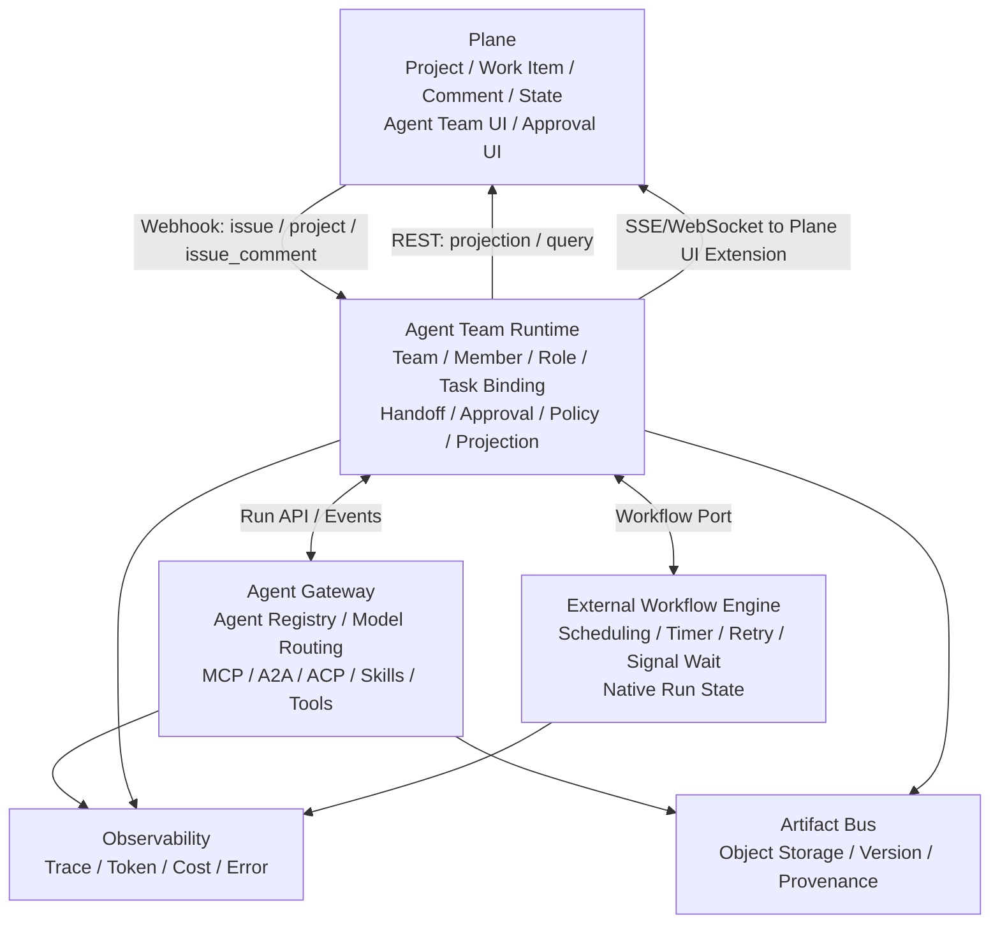
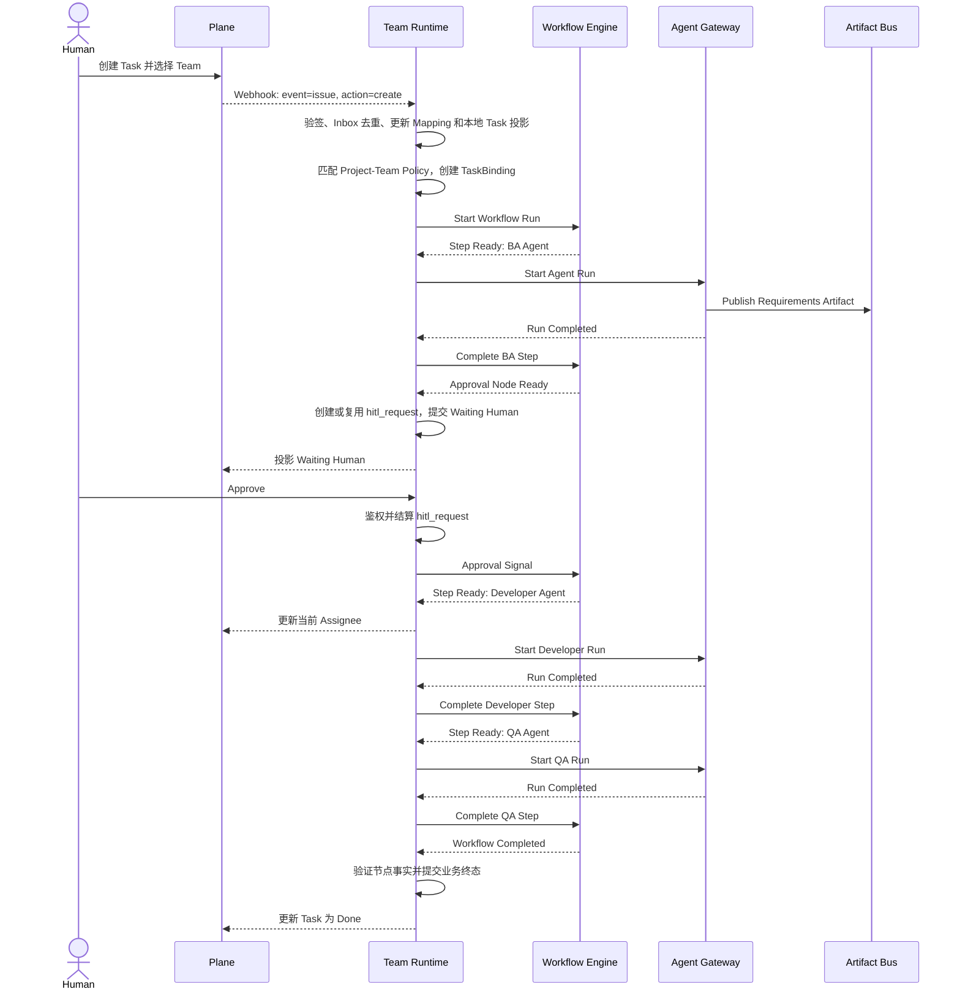

# Plane + Agent Team Runtime + Agent Gateway 落地方案

## 1. 文档目标

本文结合以下输入，给出一套可实施的 Plane、Agent Team Runtime、Agent Gateway 与外部 Workflow Engine 集成方案：

- `ChatGPT-分析NocoBase与Plane接入Agent Gateway-20260826-0617.pdf`
- Plane 当前仓库的模型、API、Webhook、前端路由和扩展边界
- `experts-backend/docs/agent-team-runtime-plan.md` 中既有 Workflow、HITL、ACP Gateway 和 Runtime 约束
- Agent 与 Human 组成 Team，共同完成 Project 中 Task 的目标
- Task 在多个 Team Member 之间的流转由外部 Workflow Engine 驱动的要求

目标不是把 Agent Runtime 写入 Plane，而是让 Plane 成为 Human 与 Agent 的统一工作台，同时保持 Agent 执行、流程控制和核心知识产权的独立性。

本文是跨系统的源设计，定义总体架构、职责和信任边界；`experts-backend/docs/agent-team-runtime-plan.md` 是 Runtime 仓库的实施计划，定义 Runtime 端口、版本化事件目录和交付出口。两者发生漂移时，不由实现自行猜测：先通过 ADR 或共享版本化契约消除冲突，再同步更新两份文档。

## 2. 核心结论

推荐采用以下职责划分：

- **Plane**：Agent Team Workspace，负责 Project、Task、评论、协作和可见状态。
- **Agent Team Runtime**：Team 的组织与流程控制面，负责 Team、Member、Role、Task Binding、Handoff、Approval 和 Policy。
- **External Workflow Engine**：持久化流程内核，负责流程实例、步骤、定时器、重试、并行、审批和补偿。
- **Agent Gateway**：Agent 执行数据面，负责 Agent 启动、模型路由、MCP/A2A/ACP、Skill、Tool、Memory 和执行遥测。
- **Artifact Bus**：成果总线，负责文档、代码、报告、数据集等 Artifact 的内容、版本和溯源。

核心原则：

1. 不把 Agent Runtime 和完整 Team 数据模型放入 Plane。
2. Plane 通过一个薄 UI 扩展展示 Runtime 数据。
3. Workflow Definition 定义流转规则，Workflow Engine 负责原生调度，Runtime 验证并提交
   Task 成员流转和业务控制状态。
4. Agent Gateway 不负责长期 Team 业务状态和流程状态。
5. Plane、Runtime、Workflow Engine 和 Gateway 不共享数据库。
6. 所有跨系统操作都必须幂等、可审计、可对账。

## 3. 总体架构



推荐把 PDF 中较宽泛的“Agent Gateway 即 Team Runtime”进一步拆分：

- Team Runtime 负责组织、权限和流程控制。
- Gateway 负责执行 Agent。
- Workflow Engine 负责原生调度、定时器、重试和持久等待；Runtime 负责归一化业务流程状态。

这样可以避免 Gateway 同时承担业务系统、工作流引擎和执行平台三种职责。

## 4. 系统职责与数据权威

| 数据或能力                         | 权威系统                      | 说明                                               |
| ---------------------------------- | ----------------------------- | -------------------------------------------------- |
| Workspace、Project、Task、评论     | Plane                         | Plane 是工作协作系统                               |
| Plane 可见状态和当前负责人         | Plane                         | 由 Runtime 根据 Workflow 结果进行投影              |
| Runtime 本地 Task 状态             | Agent Team Runtime            | `tasks.status` 是按 Project 状态方案校验的本地投影 |
| Team、角色、Human/Agent 成员       | Agent Team Runtime            | 不在 Plane 维护第二套完整 Team 数据                |
| Project-Team、Task-Team 绑定       | Agent Team Runtime            | Plane 只显示结果                                   |
| 当前步骤、下一处理人、业务控制状态 | Agent Team Runtime            | Runtime 验证并提交不可变流转事实                   |
| 原生 Run/Node 状态、定时器和重试   | Workflow Engine               | 经 Adapter 归一化；不是业务状态权威                |
| Agent、Skill、Tool、MCP、模型      | Agent Gateway                 | Gateway 是 Agent 执行权威                          |
| Agent Run、Token、Tool Call、Trace | Agent Gateway / Observability | Runtime 保存索引和业务摘要                         |
| Artifact 内容和版本                | Artifact Bus                  | 使用不可变版本和内容哈希                           |
| Artifact 与 Task/Run 的关系        | Agent Team Runtime            | Runtime 维护业务关联                               |

需要明确区分三种业务状态轴：

```text
Plane Work State:
Backlog / Todo / In Progress / Done / Cancelled

Local Task Projection Status:
tasks.status，取值来自 Project 当前绑定的 task_status_scheme

Runtime Control State:
Queued / Running / Waiting Human / Blocked / Failed / Completed / Cancelled
```

`ProjectTeamBinding.state_mapping` 显式保存三轴映射及本地状态方案 ID/Hash，不能按同名状态推断
等价关系。Workflow Engine 的原生 Run/Node 状态是经 Adapter 归一化的调度观察，不是第四个
业务状态权威。

不要把每个 Agent 执行步骤都建成 Plane State，否则 Plane 状态将与具体 Workflow 定义强耦合。

## 5. 与 Plane 当前实现的适配

### 5.1 Task 已经属于 Project

Plane 的 `Issue` 继承 `ProjectBaseModel`，天然关联 Project 和 Workspace：

- `apps/api/plane/db/models/project.py`
- `apps/api/plane/db/models/issue.py`

因此不需要改变 `Task belongs to Project` 的核心模型。

### 5.2 Assignee 可以继续表示当前处理成员

Plane 当前通过 `IssueAssignee` 将 Work Item 分配给 User。建议：

- Human 使用普通 Plane User。
- Agent 使用 Plane Bot 或 Service User。
- 当前 Workflow Step 的执行者可以同步为 Plane Assignee，但不能把 Plane 的多 Assignee 关系误当成原生的 Primary Assignee 字段。
- Team 对整个 Task 的责任关系保存在 Runtime 的 `TaskBinding` 中。

Plane 已具有 `User.is_bot`、`User.bot_type` 以及 Bot/Service API Token 的基础模型，可以作为 Agent 的展示身份和服务身份。

Plane 更新 `assignees` 时会替换整个集合。Runtime 因此必须记录自己管理的当前执行者，并采用以下 read-modify-write 规则：

1. 读取 Plane 当前 Assignee 集合。
2. 只移除上一个由 Runtime 管理的 Agent/Human Executor。
3. 保留用户手工添加的协作者。
4. 加入新的 Runtime Executor。
5. Phase 1 写入后重新读取并验证集合；检测到并发 Human 修改时进入冲突队列，不继续覆盖。

Phase 1 的 GET + PATCH 仍存在读取与写入之间的竞态，只适合受控试点。在严格 Guard 中，Plane 应在服务端事务内应用 Assignee Delta；`managed_fields` 对 Assignee 应表达为“Runtime 可增加/移除的成员集合”，而不是允许 Runtime 任意替换整个 `assignees` 字段。若产品必须展示唯一 Primary Assignee，应在 Plane Patch 中增加独立字段或扩展属性，不能假设现有模型已支持。

### 5.3 不复用现有残留 Team 模型

仓库中虽然存在简单的 `Team` 模型，但当前并不适合直接用于本方案：

- Team 只有名称、描述、Workspace 和 Logo。
- `TeamMember` 已被历史迁移删除。
- 没有完整 Team API、权限体系和前端 Store。
- Team 没有从当前模型包公开导出。

因此 Team 应由 Agent Team Runtime 管理，不建议在 Plane 内恢复旧 Team 模型。

### 5.4 Plane 没有运行时插件机制

当前项目没有“安装插件后自动加载 React 页面和 Django App”的机制：

- Django `INSTALLED_APPS` 是固定列表。
- 前端路由是编译期配置。
- Integration 模型用于 Webhook/API/Bot 连接，不会动态贡献 UI 或后端代码。

但前端存在编译期扩展路由入口：

- `apps/web/app/routes.ts`
- `apps/web/app/routes/extended.ts`
- `apps/web/app/routes/helper.ts`

所以适合维护一个薄的、编译进 Plane 的 Agent Team Extension，而不是运行时安装插件。

## 6. Agent Team Runtime 领域模型

### 6.1 Tenant 与 Plane Connection

```text
PlaneConnection
├── id
├── tenant_id
├── name
├── base_url
├── webhook_secret_ref
├── service_credential_ref
├── status
└── configuration
```

映射规则：

- 一个 Runtime Tenant 可以连接多个 Plane 实例或 Workspace，即 `Tenant 1:N PlaneConnection/Workspace`。
- Plane ID 必须与 `connection_id` 一起使用；不能假设不同 Plane 实例中的 UUID 全局唯一。
- Webhook 路由使用 `connection_id` 定位连接，并由服务端连接配置派生 `tenant_id`。
- 不信任 Webhook payload、浏览器或下游回调中自行声明的 `tenant_id`。
- Secret 只保存引用，由服务端 Secret Provider 或部署环境解析。

#### 6.1.1 Workflow Engine Connection 与 Deployment

```text
WorkflowEngineConnection
├── id
├── tenant_id
├── name
├── engine_type                  airflow | temporal | additional certified type
├── base_url
├── credential_ref
├── configuration
├── capabilities
├── status                       active | disabled | unreachable
└── last_verified_at

WorkflowEngineDeployment
├── id
├── tenant_id
├── workflow_version_id
├── engine_connection_id
├── external_definition_id
├── definition_hash
├── status                       deploying | ready | failed | retired
├── capabilities_snapshot
├── metadata
└── deployed_at
```

一个 Workflow Version 可以部署到多个 Engine Connection；
`(workflow_version_id, engine_connection_id)` 唯一。`ProjectTeamBinding` 选择默认 Connection，
Run 启动前解析并固定具体 Deployment；`engine_connection_id`、`engine_deployment_id` 和
`engine_run_id` 在外部启动被接受后不可迁移或按 ID 前缀猜测。凭据只保存 Secret 引用，
字段级契约以 `experts-backend` 实施计划 §5.11 为权威。

### 6.2 Identity

```text
Identity
├── id
├── tenant_id
├── kind                  human | agent | service
├── display_name
├── user_id               Human 类型时存在
├── expert_id             Agent 类型时存在
├── status                active | disabled
└── metadata
```

不要直接使用 `Plane User = Agent`，而应通过 Identity Mapping 统一抽象 Human、Agent 和 Service。
Human 必须有 `user_id` 且没有 `expert_id`，Agent 必须有同 Tenant 的 `expert_id` 且没有
`user_id`，Service 默认两者都没有。字段级和跨 Tenant 约束以 `experts-backend` 实施计划
§5.1 为权威。

```text
PlaneIdentityMapping
├── tenant_id
├── connection_id
├── identity_id
├── plane_workspace_id
├── plane_user_id
├── plane_user_kind
├── status
└── last_verified_at
```

### 6.3 Team 与成员

```text
Team
├── id
├── tenant_id
├── name
├── objective
├── policy_set
├── status
└── metadata

TeamMember
├── id
├── tenant_id
├── team_id
├── identity_id
├── role
├── capabilities
├── sequence
├── enabled
└── metadata
```

Team 是执行组织，不只是 Agent 列表。它还应拥有目标、协作策略、能力、知识和工具范围。
第一版 Workflow 仍由 Project 所有，`ProjectTeamBinding` 选择已发布版本；Team 本身不保存
`workflow_definition`。Team Template 和 Team-owned Workflow Library 属于 Phase 5 候选能力，
不能提前进入 v2 Team schema。

### 6.4 Project 和 Task 绑定

```text
PlaneProjectMapping
├── id
├── tenant_id
├── connection_id
├── project_id                       local projects FK
├── plane_workspace_id
├── plane_project_id
├── external_version
└── sync_status

PlaneTaskMapping
├── id
├── tenant_id
├── connection_id
├── task_id                          local tasks FK
├── plane_workspace_id
├── plane_project_id
├── plane_issue_id
├── external_version
└── sync_status

ProjectTeamBinding
├── id
├── tenant_id
├── project_id                       local projects FK
├── team_id
├── default_workflow_id
├── default_workflow_version_id
├── default_engine_connection_id
├── state_mapping
└── configuration

TaskBinding
├── id
├── tenant_id
├── project_team_binding_id
├── task_id                          local tasks FK
├── team_id
├── workflow_assignment_id
├── current_workflow_run_id          convenience pointer only
├── control_status
├── active_member_id
├── transition_version
├── last_event_id
└── timestamps

TaskBindingRun
├── task_binding_id
├── workflow_run_id
├── sequence
└── reason                           initial | manual_retry | recovery
```

Plane Work Item、Runtime 本地 Task 和 TaskBinding 是三个不同概念：

```text
Plane Work Item
  <-> plane_task_mappings     外部身份、版本和同步状态
  <-> tasks                   归一化本地投影和稳定执行上下文 FK
  <-> task_bindings           Agent Team 与 Workflow 业务控制状态
```

外部 ID 只进入 Mapping，不直接写入 `tasks.id` 或 `task_bindings`。在一个 Plane Connection
内，一个 Work Item 只映射一个本地 Task；Webhook 必须先幂等更新 Mapping 和本地投影。
只有活动 Project-Team Policy 将该 Task 置于 Agent Team 管控时才创建 TaskBinding，单纯同步
Work Item 不自动创建绑定。一个 Task 同时最多有一个非终态 TaskBinding；Team 可以在绑定内
的多个 Member 之间流转，历史 Run 由 `task_binding_runs` 完整保留，
`current_workflow_run_id` 只是当前指针。字段级契约以 `experts-backend` 实施计划为权威。

### 6.5 Handoff、Approval 和 Run

```text
Handoff
├── id
├── tenant_id
├── task_binding_id
├── from_member_id
├── to_member_id
├── workflow_run_id
├── node_key
├── status
├── reason
├── event_id
└── timestamps

Approval
├── hitl_request_id
├── task_binding_id
├── workflow_run_id
├── node_key
├── requested_from
├── status
├── decision
├── comment
└── decided_at

AgentRun
├── id
├── tenant_id
├── task_binding_id
├── workflow_run_id
├── node_key
├── attempt
├── member_id
├── expert_id
├── gateway_session_id
├── gateway_run_id
├── idempotency_key
├── status
├── cancellation_state
├── cancellation_drift
├── trace_id
├── token_usage
├── cost
└── timestamps
```

`Approval` 是跨系统概念视图，不新增一套可变审批存储。Runtime 实现继续以
`hitl_requests` 作为请求和结算权威，Plane 只展示并提交 Human 决策，Workflow Engine
只通过 signal/wait 挂起和恢复。Handoff、Approval 和 AgentRun 的字段级契约以
`experts-backend` 实施计划 §5.6–§5.7 为权威。

### 6.6 Artifact

```text
Artifact
├── id
├── tenant_id
├── task_binding_id
├── agent_run_id
├── workflow_run_id
├── node_key
├── producer_identity_id
├── artifact_key
├── type
├── name
├── version
├── content_hash
├── storage_uri
├── provenance
└── created_at
```

`artifact_key` 是一个逻辑交付物的稳定谱系键，例如 `requirements` 或 `qa-report`。
`version` 在 `(tenant_id, task_binding_id, artifact_key)` 内单调递增，该三元组加 `version`
必须唯一；producer、name、type 或 node_key 都不能单独定义版本序列。字段级契约以
`experts-backend` 实施计划 §5.8 为权威。

Artifact 可以是：

- Requirement
- Design
- API Specification
- Code/PR
- Test Case
- Test Report
- Dataset
- Decision Log
- Delivery Report

Plane Task 是工作容器，Artifact 是工作成果。

## 7. Task 执行与成员流转

以下示例流程为：`BA Agent → Human Review → Developer Agent → QA Agent`。



完整步骤：

1. 用户在 Plane 创建 Task，并选择或继承 Project Team。
2. Plane Webhook 发出 Work Item 事件。
3. Plane Connector 验签、去重并转换为统一事件。
4. Runtime 幂等创建或更新 `plane_task_mappings` 和本地 `tasks` 投影。
5. Runtime 根据本地 Project 映射和 `ProjectTeamBinding` 找到 Team；没有活动规则时只保留
   投影，不创建 TaskBinding。
6. Runtime 创建 `TaskBinding`、固定 Workflow Version 和 Engine Deployment，并启动 Run。
7. Engine 产生第一个可运行步骤，Runtime 验证当前 TaskBinding 版本后提交控制转换。
8. Runtime 调用 Agent Gateway 启动 Agent。
9. Gateway 加载 Skill、Knowledge、MCP、Tool 和 Task Context。
10. Agent 产生 Artifact，Gateway 回报 Run 结果。
11. Engine 暴露 Approval Node 或下一个可运行节点；Runtime 创建/结算 HITL 并提交成员流转。
12. Runtime 将当前 Member、状态摘要和 Artifact 投影到 Plane。
13. Engine 报告原生 Run 完成后，Runtime 验证本地节点事实并提交业务终态，再将 Plane Task
    更新为 Done。

## 8. Plane Connector

推荐把 Connector 部署在 Agent Team Runtime 的集成层：

```text
plane-connector/
├── webhook_receiver
├── signature_verifier
├── event_normalizer
├── plane_api_client
├── identity_mapper
├── projection_worker
├── reconciliation_worker
└── idempotency_store
```

职责包括：

- Plane Webhook 对原始请求字节验签。
- 将 Webhook 先写入持久化 Inbox，再异步处理；接收请求内不调用 Workflow Engine 或 Gateway。
- 将 Plane Event 转换为统一事件。
- Plane User 与 Runtime Identity 映射。
- Runtime 状态向 Plane 投影。
- 避免 Runtime 更新再次触发无限循环。
- 定期对账 Plane、Runtime 和 Workflow Engine 状态。

### 8.1 Plane Webhook 的当前约束

当前 Plane Webhook 具有以下行为：

- `event` 使用 `issue`、`project`、`issue_comment`、`cycle`、`module` 等 Plane 模型名。
- `action` 使用 `create`、`update`、`delete`。
- 字段更新通过 `activity.field`、`activity.old_value` 和 `activity.new_value` 描述；Assignee 变化不是独立的原生事件。
- `X-Plane-Signature` 是请求 JSON 的 HMAC-SHA256。
- 当前没有签名时间戳。
- `X-Plane-Delivery` 在每次发送时生成；重试可能产生新的值，不能直接作为稳定业务事件 ID。

因此，Phase 0 必须冻结以下最小 Webhook Patch 的协议契约；Patch 归属 Plane Fork，并且必须在 `experts-backend` Phase 2 生产验收前落地并通过契约测试。Connector 可以先在明确标记的非生产兼容模式下开始实现：

1. 在首次创建投递记录时生成并持久化稳定的 `event_id`/`delivery_id`，同时写入 payload 和 `X-Plane-Delivery`，同一业务事件的所有重试复用该 ID。
2. 增加 `X-Plane-Timestamp` 和签名版本，签名内容固定为 `version + "." + timestamp + "." + event_id + "." + raw_body`，避免事件 ID Header 被替换。
3. Connector 校验允许的时钟偏差并用 `(connection_id, event_id)` 唯一约束去重。
4. 固定 JSON 序列化和签名版本，便于后续兼容升级。

如果 Phase 1 暂时不能修改 Plane，Connector 可以用以下字段生成确定性摘要作为兼容性去重键：

```text
connection_id
+ webhook_id
+ event
+ action
+ data.id
+ activity.field
+ canonical(activity.old_value)
+ canonical(activity.new_value)
```

该兼容方案必须限定去重时间窗口，并承认“相同字段从同一旧值再次更新到同一新值”可能碰撞；它只用于开发验证，不能作为生产最终协议。没有 Plane 时间戳时只能依赖 TLS、Secret 轮换、Inbox 去重和接收端窗口记录降低重放风险，不能宣称已经实现基于签名时间戳的过期拒绝。

### 8.2 Plane API 限流与投影

Plane 外部 API 的 API Key 默认限流为 `60/minute`，实际值由部署配置 `API_KEY_RATE_LIMIT` 决定，并按 `X-Api-Key` 计数。`projection_worker` 和 `reconciliation_worker` 必须：

- 尽量把 `state`、`assignees` 和 `labels` 合并到一次 PATCH。
- 读取限流剩余额度和重置时间，对 429 使用带抖动的指数退避。
- 使用每个 Plane Connection 的有界队列和并发限制，避免一个 Workspace 挤占其他连接。
- 对评论和非关键摘要做合并或降频，不为每个进度事件写一条 Plane 评论。
- 在生产容量评估后显式配置更高的 `API_KEY_RATE_LIMIT`；不要把创建多个 Token 绕过限流作为默认扩容方式。
- 在重试写入前先读取或比较远端投影标记，避免 Plane API 不支持幂等键时重复产生评论或覆盖状态。

## 9. 统一事件模型

Plane 原生事件与 Runtime 统一事件必须分开定义：

| Plane 原生输入                       | 归一化条件                                    | Runtime 统一事件           |
| ------------------------------------ | --------------------------------------------- | -------------------------- |
| `event=project, action=create`       | 无                                            | `plane.project.created`    |
| `event=project, action=update`       | 无                                            | `plane.project.updated`    |
| `event=issue, action=create`         | 无                                            | `plane.work_item.created`  |
| `event=issue, action=update`         | `activity.field` 不属于 Assignee 字段         | `plane.work_item.updated`  |
| `event=issue, action=update`         | `activity.field in {assignees, assignee_ids}` | `plane.work_item.assigned` |
| `event=issue_comment, action=create` | 无                                            | `plane.comment.created`    |

`plane.work_item.assigned` 是 Runtime 内部的语义事件，不是 Plane 原生 Webhook 名称。Plane External API 使用 `assignees`，Plane Web UI 的 App API 使用 `assignee_ids`；`event_normalizer` 必须兼容两者，并用两条路径的契约测试防止 Human 修改 Assignee 时漏报。Normalizer 优先使用 Plane 已提供的 `activity` diff；只有目标 Plane 版本不提供该字段时，才通过已保存快照计算差异。

当前选定代码版本的 Issue 删除、归档和恢复路径只记录 `issue_activity`，没有调用负责
Webhook 分发的 `model_activity`，因此不能把它们列为原生输入。
`plane.work_item.deleted`、`plane.work_item.archived` 和 `plane.work_item.restored` 在 Runtime v1
目录中是由对账派生的事件；Plane Fork 将来可以提供原生输入，但必须保持统一事件语义并
通过 payload、签名、顺序、重试和恢复契约测试。

推荐采用类似 CloudEvents 的统一 Envelope：

```json
{
  "id": "evt_01...",
  "type": "plane.work_item.created",
  "source": "plane",
  "tenant_id": "tenant_123",
  "connection_id": "plane_connection_123",
  "subject": "work-item:uuid",
  "trace_id": "trace_123",
  "correlation_id": "task-binding-id",
  "causation_id": null,
  "occurred_at": "2026-08-27T10:00:00Z",
  "version": 1,
  "data": {
    "workspace_id": "...",
    "project_id": "...",
    "issue_id": "...",
    "actor_id": "..."
  }
}
```

Connector 继续传播有效的入站 W3C Trace Context；没有有效上下文时先生成新的 `trace_id`，
再持久化统一事件，并通过 Outbox、日志和下游调用继续传播。

Runtime version 1 的权威事件目录由 `experts-backend/docs/agent-team-runtime-plan.md` 冻结；本文同步记录如下：

```text
plane.project.created
plane.project.updated
plane.work_item.created
plane.work_item.updated
plane.work_item.assigned
plane.comment.created
plane.work_item.deleted        reconciliation-derived until a Plane patch supplies it
plane.work_item.archived       reconciliation-derived until a Plane patch supplies it
plane.work_item.restored       reconciliation-derived until a Plane patch supplies it

team.task.bound
team.task.control_status_changed
workflow.step.ready
workflow.handoff.requested
workflow.handoff.completed
workflow.approval.requested
workflow.approval.resolved

agent.run.started
agent.run.progressed
agent.run.completed
agent.run.failed
agent.run.cancel_requested
artifact.published

plane.projection.requested
plane.projection.applied
plane.projection.failed
reconciliation.conflict_detected
reconciliation.repaired
```

## 10. Agent Gateway API

Agent Team Runtime 不直接依赖某个 Gateway HTTP 版本，而是在内部定义稳定端口：

```text
AgentRunPort
├── start_run()
├── get_run()
└── request_cancel()
```

`request_cancel()` 表达非阻塞的取消意图，并返回 accepted、disabled/unsupported 或 failed 等明确结果，不承诺 Gateway 已经终止进程。当前 Agent Gateway v0.5 提供的是 route-scoped ACP Turn SSE 数据面，不具备本节下方的完整异步 `/v1/runs` API。Phase 1 使用 `ACPAgentRunAdapter` 消费现有 SSE，并将 Session、进度、完成和错误映射为持久化 `AgentRun`。Runtime 进程中断后，由 `WorkflowReconciliationService` 结合 `get_run()` 和 Gateway Session History（如果部署版本支持）进行对账；无法确认的结果进入 `unknown`/人工处置状态。对账是 Runtime 领域服务职责，不是 `AgentRunPort` 的额外方法。

未来 Gateway 提供异步 Run API 后，只替换 Adapter，不改变 Workflow 或 Runtime 领域模型。以下接口是目标契约，不是对当前 Gateway 已有能力的描述。

### 10.1 目标异步 Run API

```http
POST /v1/runs
Idempotency-Key: wf_123:implement-api:1
traceparent: 00-<trace-id>-<parent-id>-01
```

```json
{
  "run_id": "run_123",
  "agent_id": "developer-agent",
  "team_id": "team_123",
  "task_binding_id": "binding_123",
  "workflow_run_id": "workflow_run_123",
  "node_key": "implement-api",
  "context": {
    "plane_workspace_id": "...",
    "plane_project_id": "...",
    "plane_issue_id": "...",
    "artifact_ids": ["artifact_brd_v3"]
  },
  "capabilities": {
    "skills": ["backend-development"],
    "tools": ["plane-mcp", "github-mcp"],
    "knowledge": ["project-kb"]
  }
}
```

响应：

```json
{
  "run_id": "run_123",
  "status": "accepted",
  "trace_id": "trace_123"
}
```

查询和取消：

```http
GET /v1/runs/{run_id}
POST /v1/runs/{run_id}/cancel
Idempotency-Key: cancel:run_123:1
```

Run 状态至少包括：

```text
accepted | running | cancel_requested | completed | failed | cancelled | timed_out | unknown
```

这是目标 Gateway API 的组合状态词汇，不直接等同于 `agent_runs.status`。Runtime 持久化映射为：

- `accepted`、`running`、`completed`、`failed`、`cancelled`、`timed_out` 和 `unknown` 写入
  `agent_runs.status`；其中 `unknown` 是等待对账或人工处置的非终态状态。
- `cancel_requested` 写为 `agent_runs.cancellation_state=requested`，执行 `status` 保留最后一个
  已确认值，而不是写入第二套取消状态。
- Gateway 确认停止后写入 `status=cancelled` 和 `cancellation_state=confirmed`。
- 无法确认外部执行是否停止时独立保留 `cancellation_drift=true`，不得伪造已取消终态。

幂等语义：

- 首次接受返回 `202 Accepted`。
- 相同 Tenant、Idempotency-Key 和规范化请求哈希的重复请求返回同一个 Run，使用 `200 OK`。
- 相同 Idempotency-Key 但请求哈希不同返回 `409 Conflict`。
- 取消已取消的 Run 幂等返回 `200 OK`；取消已完成或失败的 Run 返回当前终态，不回滚结果。
- Gateway 不支持物理停止时，目标 API 可以报告组合状态 `cancel_requested`；Runtime 停止后续
  Workflow 调度，持久化 `cancellation_state=requested`，并在独立的 `cancellation_drift`
  字段记录无法确认的外部状态，直到对账确认最终结果。

### 10.2 Run 事件回调

异步 Gateway 可以向预注册的 Runtime Endpoint 发送：

```http
POST /internal/v1/gateway/run-events
X-Gateway-Timestamp: 1787805600
X-Gateway-Event-Id: gateway_evt_123
X-Gateway-Key-Id: gateway-callback-2026-08
X-Gateway-Signature: v1=<hmac-or-http-message-signature>
traceparent: 00-<trace-id>-<parent-id>-01
```

```json
{
  "version": 1,
  "event_type": "agent.run.progressed",
  "run_id": "run_123",
  "sequence": 7,
  "occurred_at": "2026-08-27T10:00:00Z",
  "status": "running",
  "progress": {
    "message": "running tests",
    "percent": 70
  },
  "usage": null,
  "error": null,
  "artifact_ids": []
}
```

Runtime 从已认证的 Gateway Credential/Key ID 派生 Tenant，不相信 Header 或 payload 自报的 Tenant。回调必须按 `(derived_tenant_id, event_id)` 去重，并按 Run 内单调 `sequence` 处理乱序事件。签名密钥在 Gateway Tenant 配置与 Runtime Secret Provider 中预先协商，不能随 Run 请求传递。

Gateway 回调签名覆盖 `version + timestamp + event_id + raw_body`；Runtime 在解析 JSON 前校验算法、Key ID、签名、时间窗口和原始字节，并保留旧验证密钥直到其可能签发的事件全部过期。

Gateway 不接受任意 `callback_url`。如果需要多目标回调，只允许请求引用预注册的 `callback_destination_id`。目标必须使用 HTTPS、主机/IP Allowlist、禁止重定向，并防止 DNS Rebinding；Runtime 也必须在解析业务 payload 前完成签名和时间戳验证。

### 10.3 Gateway 职责

Gateway 负责：

- 加载 Agent 定义。
- 选择模型并执行模型调用。
- 加载 Skill、Memory 和 Knowledge。
- 连接 MCP、A2A、ACP 和自定义 Tool。
- 提供取消、超时、重试和流式进度。
- 记录 Token、Cost、Tool Call、Trace 和错误。
- 发布 Artifact。

Gateway 不负责：

- 决定 Task 下一个 Team Member。
- 保存 Team 业务定义。
- 保存 Workflow 的长期状态。
- 直接将 Task 标记为完成。

## 11. Workflow Engine 接口

在 Runtime 内定义稳定端口。方法目录以 `experts-backend/docs/agent-team-runtime-plan.md` 冻结的版本为权威，当前为：

```text
WorkflowEnginePort
├── capabilities()
├── validate_definition()
├── deploy_definition()
├── start_run()
├── cancel_run()
├── inspect_run()
├── inspect_node()
├── signal_run()
├── read_logs()
└── reconcile_run()
```

端口返回归一化的领域结果，而不是 HTTP 响应或引擎原生 payload。适配器通过 `capabilities` 声明取消、持久 signal/wait、节点重试、分支、日志访问和定义部署等能力；Workflow Definition 要求的能力超出引擎已验证能力集时，发布在执行前失败，Runtime 不得静默模拟或降级。Human Approval 不是引擎端口方法：HITL 状态与结算权威在 Runtime 后端（`hitl_requests`），引擎只通过 signal/wait 能力挂起和恢复，早期草稿中的 `get_pending_human_tasks()` 因此移除。

每个 Run 只绑定一个 Engine Adapter 和一个不可变的引擎部署，并在整个生命周期内保持不变；不能在运行中跨引擎迁移。Headless 闭环首先复用 Airflow，但 Runtime v2 的边界验收必须按 `experts-backend` 实施计划实现并认证第二个适配器，并证明同一不可变 Workflow Definition 能通过两个适配器部署和运行。第二个适配器优先选择执行语义明显不同的 Temporal，Argo Workflows 是较低风险的 DAG 型备选；最终选择在 Phase 0 冻结。

候选引擎特性对照（不构成 v2 选型承诺）：

- BPMN、审批、会签和业务人员建模：Camunda 或 Flowable。
- 代码定义、长期运行、强恢复和 Agent-heavy 流程：Temporal。
- 简单系统联动：n8n，但不建议作为关键流程状态权威。

这些条目只用于说明引擎类别，不授权在 v2 中增加对应 Adapter。v2 继续复用现有 Airflow
Adapter 和 `WorkflowReconciliationService`，而不是先替换已交付引擎；第二个认证适配器在
Phase 0 冻结，Temporal 是验证不同持久执行语义的优先候选，Argo Workflows 是较低风险的
DAG 型备选。Camunda、Flowable、n8n 或其他系统需要未来独立 ADR 和认证测试。第二个
Adapter 不改变已有 Run 固定在 Airflow 的规则。Human Approval 长时间占用 Worker、取消
收敛和轮询容量仍是 Airflow 生产化评审项。

Workflow 定义不应直接调用 Plane 或 Gateway API，而应通过 Runtime Worker 执行副作用：

```text
Workflow Definition
        ↓ activity/job
Agent Team Runtime Worker
        ↓ connector
Plane / Agent Gateway / Artifact Bus
```

## 12. Plane Agent Team UI

### 12.1 页面结构

第一批页面：

```text
/:workspaceSlug/agent-teams
/:workspaceSlug/agent-teams/:teamId
```

Team 页面包含：

- Overview
- Human & Agent Members
- Roles
- Projects
- Active Tasks
- Runs
- Artifacts
- Workflow
- Skills / Knowledge
- Policy

### 12.2 Project Team 面板

```text
Project: Tibet Logistics Platform
Responsible Team: Delivery Team
Workflow: Software Delivery v3
Active Agents: 3
Waiting Human Decisions: 1
```

### 12.3 Task Runtime 面板

在 Work Item 详情侧边栏展示：

```text
Responsible Team
Current Member
Workflow Step
Runtime Status
Run Duration
Cost
Artifacts
Approval Actions
Execution Timeline
```

### 12.4 Agent Activity

Plane 评论只保留重要摘要，例如：

- Agent 开始执行。
- 需要 Human 决策。
- 产生新的重要 Artifact。
- Run 完成或失败。
- Task 已交接给下一位成员。

完整的 LLM Call、Tool Call、Trace 和中间输出保留在 Gateway/Observability 中，避免污染 Plane 活动流。

### 12.5 最小 Plane Patch

建议把 Plane 修改限制在：

1. Webhook 使用稳定 Event ID 和签名时间戳。
2. 为生产规模提供版本化的 Work Item 增量同步能力。
3. 通过 `extendedRoutes` 注册 Agent Team 页面。
4. Workspace 导航增加 `Agent Teams`。
5. Work Item 详情增加 Extension Slot。
6. Activity 增加 Agent Run 摘要渲染器。
7. 增加生产级 Workflow Guard。

这些 UI 修改会进入 Plane 的 AGPL 覆盖范围；Agent Team Runtime、Agent Gateway、Workflow Engine 和 Artifact Bus 应继续作为独立进程和代码库。商业发布前需要基于最终代码与部署拓扑做许可证审查。

### 12.6 双 UI 策略

本项目不应在“完全基于 Plane”与“完全自研 UI”之间二选一。推荐采用双 UI：

- **Plane Work UI**：面向普通用户、项目经理、Team Owner 和审批人。
- **Agent Team Runtime Console**：面向 Agent 开发者、Tenant 管理员和运维人员。

两套 UI 共享 Agent Team Runtime API，但服务于不同用户和信息密度。

#### 12.6.1 界面职责

| 界面或能力                                                         | 实现方式             | 主要用户             |
| ------------------------------------------------------------------ | -------------------- | -------------------- |
| Project、Task、评论、进度                                          | Plane 原生           | 所有项目成员         |
| Agent Teams                                                        | Plane 薄扩展         | 项目经理、Team Owner |
| Task Runtime 摘要                                                  | Plane 薄扩展         | Task 参与者          |
| Human Approval Inbox                                               | Plane 薄扩展         | 审批人               |
| Artifact 摘要和交付物                                              | Plane 薄扩展         | 项目成员             |
| Agent、Skill、Knowledge、MCP 配置                                  | 自研 Runtime Console | Agent 开发者         |
| Workflow Definition 和实例诊断                                     | 自研 Runtime Console | Tenant 管理员        |
| LLM、MCP、Tool Trace 和错误分析                                    | 自研 Runtime Console | 运维、开发者         |
| Token、Cost、Quota 和 Policy                                       | 自研 Runtime Console | 管理员               |
| Tenant Secret 引用、Credential、Engine/Gateway Connection 与 Route | 自研 Runtime Console | Tenant 管理员        |
| Gateway/Workflow Engine 集群、部署凭据和跨 Tenant 修复             | 运维 Console/API     | System Administrator |

Runtime Console 的产品管理能力按 Tenant 隔离，由该 Tenant 的管理员使用；Tenant 管理员只能
管理本 Tenant 的连接、路由和凭据引用，不能获得共享基础设施的管理凭据。部署级集群管理、
全局配置、跨 Tenant 诊断与修复使用配置驱动的 System Administrator 边界，不属于产品用户
角色（见 `experts-backend` 实施计划 2.11/2.12）。

Plane 回答“工作是什么、做到哪里、谁在负责、哪里需要 Human”；Runtime Console 回答“Agent 如何执行、为什么失败、调用了什么、消耗多少、如何配置和治理”。

#### 12.6.2 为什么 Work UI 基于 Plane

Plane 已经提供了成熟的：

- Workspace、Project 和 Work Item。
- 看板、列表、过滤和搜索。
- 评论、附件和活动记录。
- 成员、权限和通知。
- Cycle、Module 和 View。
- 响应式布局、国际化和用户偏好。

如果完全自研这些能力，项目会快速演变成重新开发一套 Jira、Linear 或 Plane，稀释 Agent Team 的核心价值。应当把研发投入集中在：

- Human 与 Agent 混合组队。
- Workflow 驱动的 Task Handoff。
- Agent 执行和 Human Approval。
- Artifact 生产与交付。
- Runtime 可观测性、成本和 Policy。

#### 12.6.3 为什么 Runtime Console 完全自研

Plane 的信息架构围绕工作管理，不适合承载高密度的 Runtime 诊断信息：

```text
Agent Run
├── Prompt / Context Snapshot
├── Model Calls
├── MCP Calls
├── Tool Calls
├── Retry / Checkpoint
├── Token / Cost
├── First Error
├── Trace
└── Raw Events
```

把这些信息全部放进 Plane 会导致：

- 普通用户面对大量不必要的技术细节。
- Task 页面过于复杂。
- Plane 模型被 Gateway 实现细节污染。
- Runtime Console 的发布节奏与 Plane Fork 绑定。
- 未来接入其他 Work OS 时无法复用 Runtime UI。

因此应独立部署 Runtime Console，例如：

```text
https://runtime.example.com
```

Plane 中只提供 `View full run`、`Open trace`、`Manage agent`、`Edit workflow` 和 `View cost details` 等深链接。

#### 12.6.4 Plane 嵌入边界

Plane 内只保留面向工作协作的摘要和命令：

```text
Responsible Team: Delivery Team
Current Member: Developer Agent
Workflow Step: Implement API
Status: Running
Duration: 12m
Cost: $0.46

Artifacts
- API Specification
- Pull Request

[Pause] [Cancel] [View full run]
```

Human Approval 也应在 Plane 内完成，因为审批是工作协作的一部分：

```text
Developer Agent requests approval

Decision:
Use asynchronous declaration processing?

[Approve] [Reject] [Request changes]
```

这些按钮向 Runtime 提交 Command，由 Workflow Engine 决策，不能直接修改 Plane State。

#### 12.6.5 不推荐的 UI 方案

不推荐深度 Fork Plane，把 Team、Agent、Workflow、Run、Memory、MCP 和 Observability 全部写入 Plane。这样会造成严重的上游升级冲突、模型耦合和许可证边界扩大。

当前阶段也不推荐完全自研 Work UI。只有满足以下条件时，才应考虑发展独立的 Agent-first Workspace：

- Objective、Run 和 Artifact 已经取代 Task 成为主要交互对象。
- Plane 的 Project/Task UX 明显限制核心产品体验。
- 团队有能力长期维护权限、通知、搜索、看板和移动端能力。
- 产品明确要求 Work UI 独立闭源或脱离 Plane。

iframe 可以用于短期 Demo，但不建议作为长期集成方式，因为会带来认证、Cookie、CSP、跨域、导航、深链接和布局问题。长期应使用 Plane 原生摘要组件加 Runtime Console 深链接。

#### 12.6.6 推荐代码组织

```text
plane-fork/
├── Plane 原始代码
└── 薄扩展
    ├── Agent Teams 路由
    ├── Task Runtime Panel
    ├── Approval UI
    └── Runtime API Client

agent-team-console/
├── Agent Registry
├── Team Definition
├── Workflow Management
├── Run Explorer
├── Trace Viewer
├── Artifact Explorer
├── Cost / Quota
├── Policy
└── Gateway Administration

agent-team-runtime/
└── 独立后端服务

agent-gateway/
└── 独立执行服务
```

Plane Extension 只能依赖稳定的 Runtime HTTP API 和事件协议，不能导入 Runtime 或 Gateway 源码。

#### 12.6.7 认证与导航

两套 UI 应使用统一身份提供方和 Tenant Mapping：

- Plane User 映射为 Runtime Identity。
- Plane 与 Runtime Console 使用同一个 OIDC/SSO 身份源。
- Plane 页面调用 Runtime API 时使用短期用户令牌或 BFF，不在浏览器保存 Service Credential。
- 从 Plane 跳转 Runtime Console 时携带不可伪造的 Task/Run 标识，不传递长期 Token。
- Runtime 再次校验用户对 Workspace、Project、Team 和 Run 的访问权限。

#### 12.6.8 演进路线

```text
阶段 1
Plane 原生 Work UI + 最小 Webhook Patch + 独立 Runtime Console
先跑通 Task → Workflow → Agent → Artifact → Plane

阶段 2
Plane 薄扩展
加入 Agent Teams、Task Runtime 和 Human Approval

阶段 3
建立稳定 Extension Slot
减少升级 Plane 时的代码冲突

阶段 4
根据真实用户行为，决定是否发展独立 Agent-first Workspace
```

默认决策是：不自研 Plane 已经成熟的 Work Management UI，也不把 Runtime Console 强行塞进 Plane。

## 13. Workflow Guard

当前 Plane 在更新 Work Item 时，主要检查目标 State 是否属于当前 Project，并没有验证外部 Workflow 是否允许这次转换。因此只在前端禁用按钮不够安全。

建议在 Plane 增加最小受控任务记录：

```text
ExternalWorkflowBinding
├── issue_id
├── provider
├── external_binding_id
├── applied_transition_version
├── managed_state
├── runtime_managed_assignee_id
└── enabled
```

对于受控 Task：

- 普通用户不能直接修改受控的 `state`、Runtime 管理的 Executor 和 Team 绑定；不受控的 Human Collaborator 仍可按 Plane 权限增删。
- 用户操作转换成 Runtime Command。
- Engine 确认后，由 Workflow Service Bot 更新 Plane。
- 更新请求携带短期签名的 Transition Permit。
- Plane 校验签名、Task、Binding、允许字段、版本、签发方、受众、时间窗口和一次性 ID。

Permit 使用 compact JWS。Protected Header 示例：

```json
{
  "alg": "EdDSA",
  "kid": "runtime-permit-2026-08",
  "typ": "plane-transition+jwt"
}
```

Claims 示例：

```json
{
  "iss": "agent-team-runtime",
  "aud": "plane-workflow-guard:plane_connection_123",
  "jti": "permit_01...",
  "iat": 1787805540,
  "exp": 1787805600,
  "plane_issue_id": "plane-issue-id",
  "task_binding_id": "binding-123",
  "transition_version": 13,
  "allowed_changes": {
    "state_id": "done-state-id",
    "assignee_delta": {
      "remove_runtime_managed_id": "developer-agent-user-id",
      "add_runtime_managed_id": "qa-agent-user-id"
    }
  }
}
```

`plane_issue_id` 是外部 Plane Work Item ID，不是 Runtime 本地 `tasks.id`；
`task_binding_id` 是 Runtime 控制记录。生产 `aud` 必须唯一绑定目标 Plane Connection 或部署，
不能让互不相关的 Plane 实例共享一个宽泛受众。签名私钥只存在于 Runtime Secret Provider；
Plane 只配置当前公钥和仍在有效期内的轮换旧公钥。禁止 `alg=none`，并按 `kid` 选择受信公钥。
已消费 `jti` 至少保留到 `exp + clock_skew`，再按审计策略归档。Permit 不是通用 Runtime
Access Token。

### 13.1 transition_version CAS 语义

Runtime 的 `TaskBinding.transition_version` 是控制版本权威；Plane 的 `ExternalWorkflowBinding.applied_transition_version` 只是最后成功投影版本的副本。规则如下：

1. Runtime 在同一个数据库事务中提交控制状态变化并将版本从 `N` 增加到 `N+1`，然后为 `N+1` 创建 Outbox Projection。
2. Permit 携带 `transition_version=N+1`、精确允许变化和唯一 `jti`。
3. Plane 在一个数据库事务中锁定 `ExternalWorkflowBinding`，要求当前版本等于 `N`，校验 Plane 当前受控字段前置值，然后应用精确变化。
4. Plane 将 `applied_transition_version` 原子更新为 `N+1`，并记录 `jti`、请求哈希和结果。
5. 相同 `jti`、版本和请求哈希的重试返回原结果 `200 OK`，不再次执行副作用。
6. 已消费 `jti` 携带不同请求、旧版本或同版本不同变化返回 `409 Conflict`。
7. Permit 版本跳跃、Plane 前置值不匹配返回 `412 Precondition Failed`，由 Runtime 触发定向对账，不盲目重试覆盖。
8. 签名、受众、时间窗口或字段越权失败返回 `401/403`，且不得修改版本。

这套 CAS 同时提供主要的 Replay 防护；`jti` 一次性记录负责识别同版本恶意变体和保留审计事实。

Phase 1 Headless MVP 可以先采用 UI 软约束和后台对账；Production Acceptance 前必须实现后端 Guard。

## 14. 权限与身份

权限需要同时满足两层规则：

1. Plane Workspace/Project Membership。
2. Agent Team Runtime 中的 Team Role 和 Workflow Policy。

推荐规则：

- Plane Human User 映射为 Runtime Human Identity。
- Plane Bot/Service User 映射为 Runtime Agent 或 Service Identity。
- Gateway 使用独立 Service Credential，不使用 Human Token。
- Runtime 不信任浏览器提交的 Plane Role，必须服务端重新验证。
- Workflow Callback、Gateway Callback 和 Webhook 都必须验签。
- Tenant 由服务端 `PlaneConnection` 或 Gateway Credential 派生，永不采用外部 payload 自报值。
- Artifact 访问权限继承 Tenant、Project、Task 和 Team Policy。

目标权限模型不保留数据库中的 Platform User 或 Platform Role。Phase -1 删除对应的创建、
激活、授权和 Token Claim 流程；Tenant Admin 通过 Tenant RBAC 管理本 Tenant 的后台资源，
不能访问其他 Tenant。跨 Tenant 的部署诊断、全局配置和修复操作由配置驱动的 System
Administrator 边界保护，其主体或私有化部署凭据来自 IdP、Secret Provider 或部署配置，
不写入业务用户、成员或角色表。System Administrator 不自动获得 Tenant 权限，所有操作
记录可归因的外部主体。现有 Platform 权限只描述 Phase -1 前的 shipped-code 兼容状态。

## 15. 可靠性与一致性

第一版就应设计：

- Webhook 稳定 Event ID、持久化 Inbox 和去重；在 Plane Patch 完成前使用明确标注为兼容模式的确定性摘要。
- Transactional Outbox，避免数据库提交成功但事件丢失。
- Agent Run 幂等键。
- Workflow Signal 幂等。
- `transition_version` 乐观并发控制。
- Gateway 和 Workflow Callback 签名。
- Runtime 更新来源标记，避免 Plane Webhook 回环。
- Engine/Gateway 不可用时保持 Pending，不错误更新为 Done。
- Artifact 使用不可变版本和内容哈希。
- 全链路使用 W3C Trace Context，并在业务事件中保留 `trace_id`、`correlation_id` 和 `causation_id`。
- 定时 Reconciliation，比较 Plane、Runtime 和 Engine 状态。

### 15.1 对账策略

```text
Plane Task
   ↕
PlaneTaskMapping / Local Task Projection
   ↕
TaskBinding / Transition Version
   ↕
Workflow Run / Pinned Engine Deployment
   ↕
Active Agent Run
```

发现不一致时：

1. Runtime 已提交的 TaskBinding、Workflow Run/Node 和 HITL 事实是业务控制状态权威。
2. Adapter 读取 Workflow Engine 原生状态并归一化；只能按合法状态机推进或产生 Drift，不能
   直接覆盖 Runtime 业务事实。
3. Runtime 修复可证明缺失的本地投影，再重新投影 Plane。
4. 不自动覆盖无法解释的 Engine 状态或 Human 修改，进入人工处置队列。

### 15.2 Phase 1 最小对账

Plane Webhook 虽然有异步重试，但连接停用、长期网络故障、删除/归档路径差异或事件契约变化仍可能导致遗漏。Headless 闭环不能只依赖 Webhook，Phase 1 必须包含：

- **映射/投影兜底扫描**：发现尚无 Mapping 或本地 Task 投影的 Plane Work Item。
- **启动兜底扫描**：发现已有本地投影、符合 Project-Team 规则但尚无非终态 TaskBinding 的
  Plane Work Item。
- **投影重试扫描**：发现已提交 Runtime Transition 但 Plane Projection 未成功的记录。
- **Run 终态扫描**：发现 Workflow/Gateway 已终止但 Runtime 仍处于运行状态的记录。
- **游标与重叠窗口**：扫描游标持久化，每轮保留重叠时间窗口，所有结果继续依赖唯一约束保证幂等。

当前 Plane 外部 Work Item 列表 API 没有稳定的 `updated_at` 增量过滤契约。Phase 1 可在单 Workspace/Project 限制下分页扫描并与本地映射比较；生产规模前应增加经过版本化的增量同步端点或最小 Plane Patch，不能把不存在的过滤参数写成既有能力。

Phase 1 的对账只自动修复“缺少映射/本地投影或绑定”和“Runtime 已知投影失败”。跨
Plane、Runtime、Workflow、Gateway 的全面漂移分类、冲突队列和故障注入仍在可靠性阶段
完成。

### 15.3 Task 生命周期

Plane Archive 与 Delete 必须分别处理：

| Plane 操作               | Runtime 行为                                                                                                                | 恢复行为                                                   |
| ------------------------ | --------------------------------------------------------------------------------------------------------------------------- | ---------------------------------------------------------- |
| Archive                  | Plane 当前只允许 Completed/Cancelled Work Item 归档；Runtime 保持终态并停止任何新调度                                       | Unarchive 只恢复可见性，不自动新建或续跑 Workflow          |
| Delete active Task       | Mapping 记录源删除，停止派发新步骤并走统一 Workflow/Agent 取消路径；TaskBinding 收敛为 `cancelled`，Artifact 和审计记录保留 | 不自动续跑；管理员显式选择重新绑定、从检查点恢复或保持终止 |
| Delete terminal Task     | Mapping 记录源删除，TaskBinding 保留既有终态、Artifact 和审计记录                                                           | 恢复映射和可见性，不创建新 Run                             |
| Project archived/deleted | 冻结其全部活动绑定并进入批量对账/取消流程                                                                                   | 管理员重新验证 Project-Team Binding 后显式恢复             |

删除、归档和恢复事件在选定 Plane 版本上必须做契约测试。若原生 Webhook 不覆盖某条路径，由最小对账扫描发现；不能假设所有 Issue Activity 都会自动转换成 Webhook。

## 16. 可观测性

跨服务追踪采用 W3C Trace Context：

- HTTP、Webhook 转发和内部回调使用 `traceparent`，可选使用 `tracestate`。
- Plane 原生 Webhook 没有 `traceparent` 时，Connector 创建新的 Root Span，并把生成的 `trace_id` 写入统一事件。
- Runtime 调用 Workflow Engine、Gateway、Artifact Bus 和 Plane API 时继续传播该 Context。
- `correlation_id` 表示 TaskBinding，`causation_id` 表示直接触发当前事件的上一事件；两者不能替代 Trace Context。
- 不把 Tenant Secret、Prompt、完整 Tool 参数或高基数业务 ID 无条件写入 Metrics Label；高基数值进入 Trace/Log。

每个 Task 需要能够追踪：

```text
Plane Work Item
  → Plane Task Mapping / Local Task Projection
    → TaskBinding
      → Workflow Run / Engine Deployment
        → Workflow Step
          → Agent Run
            → LLM Call
            → MCP/Tool Call
            → Artifact
```

核心指标：

- Task 从创建到启动的延迟。
- 每个 Workflow Step 的耗时。
- Agent Run 成功率和重试次数。
- Human Approval 等待时间。
- Token、Cost 和模型使用量。
- Handoff 次数。
- Artifact 数量和返工率。
- First Error 与最终 Customer Failure 的关联。

## 17. 部署拓扑

推荐独立部署：

```text
plane-web
plane-admin
plane-space
plane-live
plane-api
plane-worker
plane-beat-worker
plane-migrator
plane-proxy
plane-postgres
plane-redis
plane-mq
plane-object-storage

team-runtime-api
team-runtime-worker
team-runtime-postgres

workflow-engine

agent-gateway
agent-workers

artifact-object-storage
event-bus
observability-stack
```

约束：

- 不共享数据库 Schema。
- 跨边界只通过 API、Webhook 和事件通信。
- Secret 分系统管理。
- Plane 数据库不能被 Runtime 或 Gateway 直接写入。

MVP 阶段可以先使用 PostgreSQL Outbox 和现有 Workflow Engine 的任务机制，避免过早引入复杂事件基础设施；规模扩大后再引入 NATS JetStream 或 Kafka。

## 18. 分阶段实施

本文按跨系统产品能力分期，`experts-backend` 按 Runtime 仓库交付分期，两者编号不能直接互换：

| 本文阶段                   | `experts-backend` 实施阶段                             | 关系说明                                                                  |
| -------------------------- | ------------------------------------------------------ | ------------------------------------------------------------------------- |
| （无对应阶段）             | Phase -1 Remove legacy product domains                 | Runtime 仓库内部清理 Billing、Tenant 类型与 Platform User；无跨系统交付物 |
| Phase 0 契约与边界         | Phase 0 Contracts and boundaries                       | 共同冻结职责、端口、事件与安全契约                                        |
| Phase 1 Headless 闭环      | Phase 1 Runtime core + Phase 2 Plane Connector         | Runtime Core 是 Connector 闭环的前置；本文 Phase 1 横跨实施计划两个阶段   |
| Phase 2 独立 Agent Team UI | Phase 4 Runtime Console API 的前置或子集               | 先以独立页面验证查询、审批和操作契约                                      |
| Phase 3 嵌入 Plane         | Phase 4 Runtime Console API and Plane extension        | Plane Extension 依赖稳定 Runtime HTTP/Event 契约                          |
| Phase 4 严格工作流控制     | Phase 5 Strict workflow control + Phase 3 的可靠性能力 | Guard 对应 Phase 5；全面收敛依赖此前 Phase 3 Reliability and operations   |
| Phase 5 平台化             | （无对应已承诺阶段）                                   | 未来通过独立 ADR/实施计划评审，不属于 Runtime v2 Definition of Done       |

若同名 Phase 的出口标准不同，以各自仓库负责的交付物为准；跨仓库接口和事件必须先更新共享契约或 ADR。

### Phase 0：契约与边界

确定：

- Identity、Team、Plane Mapping、本地 Task 投影、TaskBinding、Run、Artifact 模型及其边界。
- 锁定集成使用的 Plane Release/Commit，并通过契约测试固定原生 Webhook/API 行为。
- 冻结 Plane 稳定 Webhook Event ID、签名时间戳和原生事件到统一事件的映射规范；本阶段不把尚未完成的 Plane Fork Patch 描述为已实现能力。
- `AgentRunPort`、当前 ACP SSE Adapter 与未来异步 Gateway Run API 边界。
- Workflow Engine Port、能力协商和第二个认证适配器选择。
- Plane 可见状态、Runtime 业务控制状态、HITL 与 Engine 原生调度状态的权威边界。
- ID、幂等键、JWS/CAS 和 W3C Trace Context 传播规范。

### Phase 1：Headless 闭环

不修改 Plane UI，完成：

```text
Plane 创建 Task
→ Webhook
→ Inbox / Normalizer
→ Runtime 幂等创建 Mapping 和本地 Task 投影
→ 匹配 Project-Team Policy 后创建 TaskBinding
→ Engine 启动 Workflow
→ ACP Adapter 调用当前 Gateway
→ Artifact 产生
→ Plane 评论、负责人、状态更新
```

可靠性基线：

- 独立 Runtime Worker 处理 Inbox、Outbox 和 Projection，并使用数据库租约避免重复 Worker。
- 有界重试、Dead Letter 状态和 API 限流退避。
- Mapping/Task 投影兜底、启动兜底、投影失败和 Run 终态扫描。
- 删除/归档生命周期至少能停止新步骤并保留审计。
- 当前 Gateway 不支持物理取消时，显式记录 Cancellation Drift。

范围限制：

- 一个 Workspace。
- 一个 Project-Team Binding。
- 一个 Workflow 定义。
- Headless Demo 的每个 Run 只选择一个 Engine Adapter；与此同时，Runtime v2 必须完成 Airflow 与第二个认证适配器的契约测试，满足其 Phase 1 出口标准。
- 两个 Agent。
- 一个人工审批步骤。

### Phase 2：独立 Agent Team UI

先通过独立页面验证 UX：

```text
https://agent.example.com/plane/{workspace}/{project}/team
```

主要验证：用户是否愿意将整个 Project 或单个 Task 交给 Agent Team。

### Phase 3：嵌入 Plane

使用编译期 Extension 增加：

- Agent Teams。
- Task Runtime Panel。
- Approval Inbox。
- Run/Artifact Drawer。

Phase 0 只冻结最小后端 Webhook Patch 的契约。Headless Connector 可以先使用明确标记的非生产兼容模式；该 Patch 必须在 Headless 闭环生产验收前进入 Plane Fork 并通过契约测试。本阶段开始增加 UI Patch。两类修改维护在同一个尽可能小的 Plane Fork 中，并分别做上游兼容测试。

### Phase 4：严格工作流控制

增加：

- Plane Workflow Guard。
- JWS Transition Permit 和 `jti` Replay 防护。
- `transition_version` CAS 和受控 Assignee 集合语义。
- 全面状态对账、冲突队列和故障恢复；Phase 1 的最小兜底扫描继续保留。
- 审计和权限测试。

### Phase 5：平台化

验证核心闭环后，再考虑：

- 多 Workflow Definition。
- Team Template。
- 动态组队。
- 多 Project Team。
- 可视化流程设计器。
- 成本预算和 Policy。
- NocoBase Business OS。
- 多租户计费（Billing 位于 Agent Team Runtime 域之外，由独立评审的边界承载，见 `experts-backend` 实施计划 2.10）。

## 19. 分阶段验收场景

建议采用交付型 Demo：

```text
Project: Tibet Border Logistics Training Platform

Team:
- Human Product Owner
- PM Agent
- BA Agent
- Developer Agent
- QA Agent

Workflow:
需求进入
→ PM 拆解
→ BA 产生 Requirements.md
→ Human 审批
→ Developer 实现
→ QA 测试
→ Human 验收
→ 完成
```

### 19.1 Phase 1 Headless MVP

验收标准：

1. Plane 创建受 Project-Team Policy 管控的 Work Item 后，只产生一个 Mapping 和本地 Task
   投影，并在 10 秒内创建 TaskBinding、启动 Workflow；不受管控的 Work Item 只同步投影。
2. Plane 能看到当前处理人和关键执行摘要；Runtime API 能查询负责 Team 和当前步骤。
3. Agent Run 可以追踪和重试；取消请求至少停止后续 Workflow 调度，不支持物理取消时显示 Cancellation Drift。
4. Human 能通过 Runtime Approval API 批准或驳回，不要求此阶段已有 Plane 内嵌 UI。
5. 每次成员交接都有审计记录。
6. Artifact 能追溯到 Task、Run、Agent 和版本。
7. 重复 Webhook 不会重复创建 Mapping、TaskBinding、Workflow Run 或 Agent Run。
8. Runtime 或 Gateway 重启后 Workflow 可以继续，无法确认的 ACP Session 进入可见的人工处置状态。
9. 故意漏掉一次 Work Item 创建 Webhook 后，最小兜底扫描能依次幂等补建 Mapping、本地
   Task 投影和适用的 TaskBinding。
10. Plane API 发生 429 或短期失败后，Projection 最终收敛且不覆盖 Human Assignee。

### 19.2 Production Acceptance

进入生产受控模式还必须满足：

1. Human 能在 Plane 内批准或驳回，并由 Runtime 服务端重新验证权限。
2. 普通用户不能绕过 Workflow 修改受控 State 或 Runtime 管理的 Assignee。
3. 过期、重放、字段越权、旧版本和版本跳跃的 Permit 均被拒绝。
4. Plane、Runtime、Workflow Engine 和 Gateway 在可解释的部分失败后能自动对账收敛。
5. 无法解释的 Human 修改进入冲突队列，不被静默覆盖。
6. Delete、Archive、Restore 和 Project Archive 的生命周期策略通过集成测试。
7. Tenant/Connection 隔离、Callback SSRF 防护、签名密钥轮换和审计测试通过。

## 20. Phase 1 Headless MVP 不包含的范围

第一版明确不做：

- 通用可视化 Workflow Designer。
- 在同一个 Run 中切换或组合多个 Workflow Engine，以及未经认证的任意引擎插件；Runtime v2 仍须提供 Airflow 和第二个认证适配器。
- 自动生成任意 Team 组织结构。
- 完整计费系统。
- 将完整 Agent Trace 写入 Plane 评论。
- 在 Plane 数据库保存 Agent Memory 和 Artifact 内容。
- NocoBase 双向业务同步。
- Plane 后端 Workflow Guard；Phase 1 只能用于受控试点，不能在 Guard 完成前宣称满足 Production Acceptance。

## 21. 最终产品定位

> Plane 是 Agent Team Workspace，Agent Team Runtime 是组织与业务流程控制面，Agent Gateway
> 是 Agent 执行数据面，Workflow Engine 是可替换的外部调度与持久等待内核。

用户看到的是一支 Human 与 Agent 混合团队在 Plane 中完成 Project，而不是底层的 Agent 编排平台。

Plane 回答：

- 要完成什么工作？
- 当前做到哪里？
- 谁正在负责？
- 哪些事情需要 Human 处理？

Agent Team Runtime 回答：

- 这支 Team 如何组织？
- Task 属于哪支 Team？
- 当前流程步骤是什么？
- 下一步交给谁？
- 哪些策略和审批必须满足？

Agent Gateway 回答：

- Agent 如何执行？
- 使用哪个模型？
- 加载哪些 Skill、Memory 和 Tool？
- 如何调用 MCP/A2A/ACP？
- 执行成本、错误和 Trace 是什么？

这种分层既能利用 Plane 已有的成熟工作管理 UI，又能保持 Agent Team Runtime 和 Agent Gateway 的独立演进能力。
